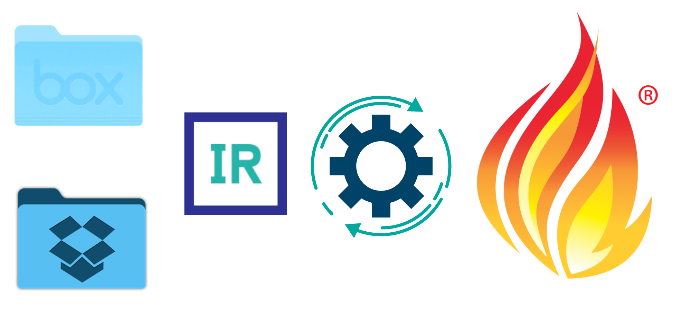

# FHIR Drop FHIR Box MFT 2 FHIR

A simple production that enables FHIR transaction bundles to be loaded into InterSystems® FHIR® Server via Box and Dropbox.  Using the included MFT Connection Components and a 14 liner Custom Business Process, this production will process your transaction bundles to FHIR Resources for immediate consumption with Harry Potter like wizardry.  Great for Hackathons, Research and FHIR® Cocktail parties. 

  

## Community

Support resources for community post:

[FHIRDrop, FHIRBox - Managed File Transfer to FHIR®](https://community.intersystems.com/post/fhirdrop-fhirbox-managed-file-transfer-fhir%C2%AE)
